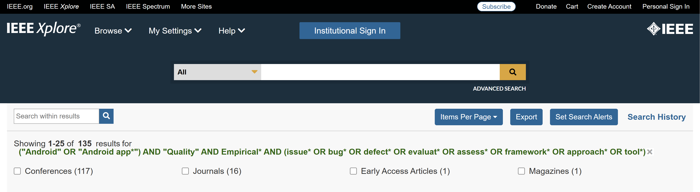
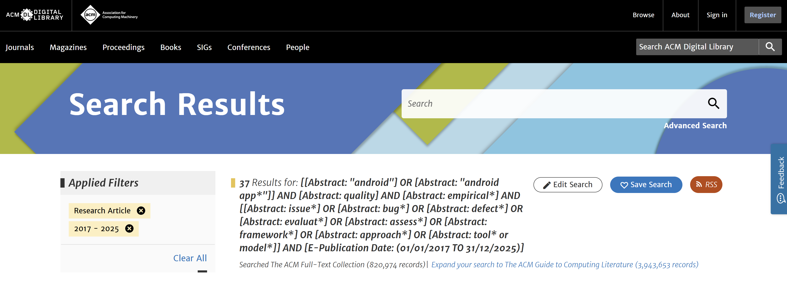
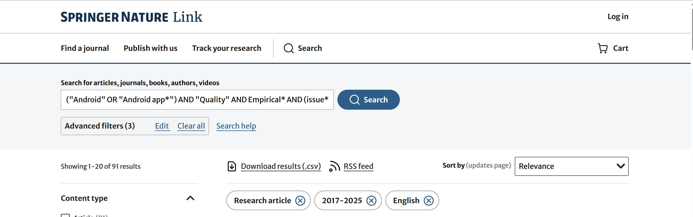
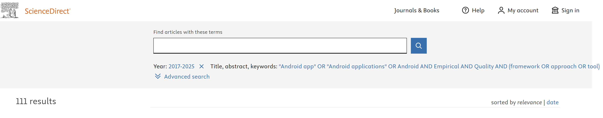
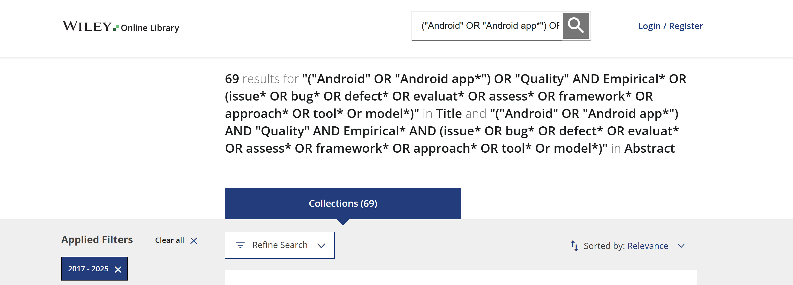

# Executed Search Queries and Filters

This document provides the exact executed search strings, applied filters, result counts, and visual execution logs for each database used in the systematic literature review.

All searches were executed between 10–15 January 2025.

The general protocol-level query was:

("Android" OR "Android app*") AND "Quality" AND Empirical* AND (issue* OR bug* OR defect* OR evaluat* OR assess* OR framework* OR approach* OR tool* OR model*)

Minor syntax adaptations were applied where required due to database-specific constraints (e.g., wildcard support, Boolean clause limits).

---

## 1. IEEE Xplore

### Executed Query
(("Android" OR "Android app*") AND "Quality" AND Empirical* AND (issue* OR bug* OR defect* OR evaluat* OR assess* OR framework* OR approach* OR tool*))

### Filters Applied
- Publication Years: 2017–2025
- Content Type: Conferences and Journals

### Results Retrieved
135 records

### Execution Log

---

## 2. ACM Digital Library

### Executed Query
(("Android" OR "Android app*") AND "Quality" AND Empirical* AND (issue* OR bug* OR defect* OR evaluat* OR assess* OR framework* OR approach* OR tool* OR model*))

### Filters Applied
- Publication Years: 2017–2025
- Content Type: Research Articles
- Collection: ACM Full-Text Collection

### Results Retrieved
37 records

### Execution Log

---

## 3. SpringerLink

### Executed Query
(("Android" OR "Android app*") AND "Quality" AND Empirical* AND (issue* OR bug* OR defect* OR evaluat* OR assess* OR framework* OR approach* OR tool*))

### Filters Applied
- Publication Years: 2017–2025
- Content Type: Research Article
- Language: English

### Results Retrieved
91 records

### Execution Log

---

## 4. ScienceDirect

(Note: ScienceDirect does not consistently support wildcard symbols within quoted phrases; therefore, minor syntax adjustments were required.)

### Executed Query
(("Android app" OR "Android applications" OR Android) AND Quality AND Empirical AND (framework OR approach OR tool OR defect OR issue))

### Filters Applied
- Publication Years: 2017–2025
- Fields: Title, Abstract, Keywords

### Results Retrieved
111 records

### Execution Log

---

## 5. Wiley Online Library

### Executed Query
(("Android" OR "Android app*") AND "Quality" AND Empirical* AND (issue* OR bug* OR defect* OR evaluat* OR assess* OR framework* OR approach* OR tool* OR model*))

(Search applied in Title and Abstract fields)

### Filters Applied
- Publication Years: 2017–2025
- Fields: Title and Abstract

### Results Retrieved
69 records

### Execution Log

---

# Total Initial Retrieval

IEEE: 135  
ACM: 37  
Springer: 91  
ScienceDirect: 111  
Wiley: 69  

**Total: 443 records**

These records were subsequently deduplicated and processed according to the PRISMA-based screening protocol described in the manuscript.
